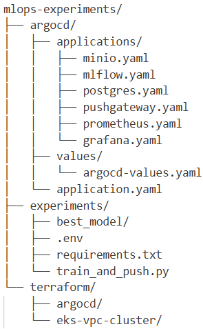
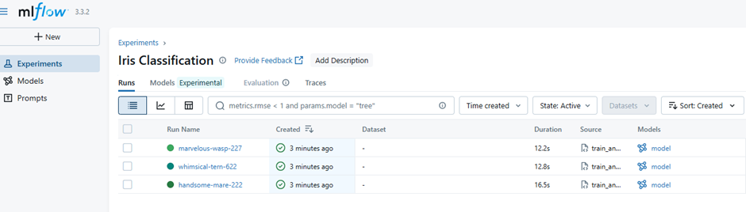
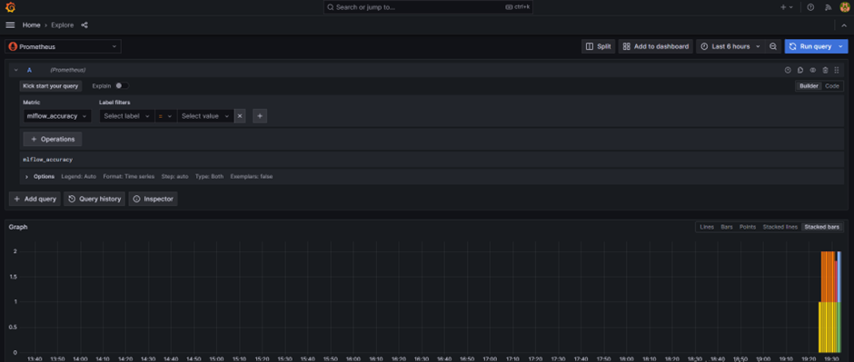

**Cтруктура проекту**

 

**1. Налаштування середовища:**

        cd mlops-experiments/experiments
        pip install -r requirements.txt

**2. Розгортання інфраструктури:**

- запуск EKS Cluster:

        cd terraform/eks-vpc-cluster
        terraform init
        terraform apply

- оновлення kubeconfig:

        aws eks update-kubeconfig --region us-east-1 --name goit --profile default

- встановлення ArgoCD:

        cd terraform/argocd
        terraform init
        terraform apply

- застосування applications:

        kubectl apply -f mlops-experiments/argocd/application.yaml

- перевірка наявності MLflow та  PushGateway у кластері:

        kubectl get applications -n argocd
        kubectl get applications -n monitoring

- port-forward:

-- MLflow UI (порт 5000):

        kubectl port-forward -n application svc/mlflow 5000:5000

        http://localhost:5000

-- MinIO API (порт 9000):

        kubectl port-forward -n application svc/minio 9000:9000

-- MinIO UI (порт 9001):

        kubectl port-forward -n application svc/minio 9001:9001

        http://localhost:9001

-- PushGateway (порт 9091):

        kubectl port-forward -n monitoring svc/prometheus-pushgateway 9091:9091

        http://localhost:9091і

-- Prometheus (порт 9090):

        kubectl port-forward svc/prometheus-server -n monitoring 9090:80

        http://localhost:9090

-- Grafana (порт 3000):

        kubectl port-forward svc/grafana -n monitoring 3000:80

        http://localhost:3000

- запуск експериментів:

        cd mlops-experiments/experiments
        python train_and_push.py

Скрипт виконує:

Тренування LogisticRegression на датасеті Iris з різними параметрами

Логування метрик (accuracy, loss) та моделі в MLflow

Відправку метрик в PushGateway

Збереження найкращої моделі в папку best_model/

**Результати експериментів доступні в MLflow UI:**

http://localhost:5000 

**Перегляд метрик в Grafana:**

http://localhost:3000

    login:    admin
    password: admin123

Explore → Prometheus

Запит: mlflow_accuracy > Run query

**Знищення інфраструктури:**

- видалення ArgoCD:

        cd terraform/argocd
        terraform destroy

- видалення EKS Cluster:

        cd terraform/eks-vpc-cluster
        terraform destroy

- видалення s3 bucket